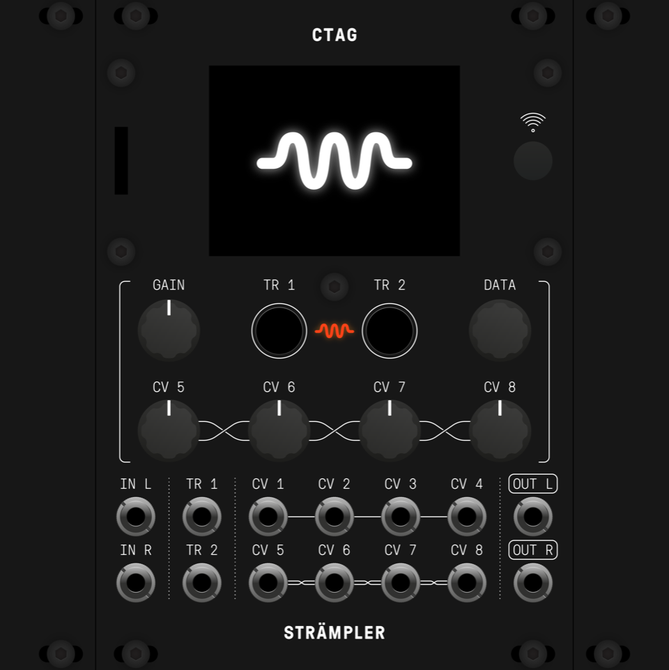

# Strämpler Build Pack

Everything you need to **build your own [CTAG Strämpler](https://github.com/ctag-fh-kiel/ctag-straempler)** —
the open-source ESP32 eurorack sample-streaming module — in its compact
**18 HP Antumbra redesign**. Board files in both Eagle *and* KiCad, complete
BOMs with 2026 sourcing fixes, a ready-to-upload fab/assembly package, and
per-kit ordering guides.

## Why this repo exists

The original design files live inside the firmware repo and are in **Eagle
format — a dead tool** (Autodesk sunset Eagle in 2026). The ready-made
panel/PCB sets that used to be sold are delisted. Several key parts of the
2019 BOM have gone EOL. This pack collects the originals, converts them to
a living format, and documents what it actually takes to build one today.

## What's here

| Path | Contents |
|---|---|
| `hardware-eagle/` | The designer's original Eagle 7.3 files: main board + schematic + FR4 panel (untouched) |
| `hardware-kicad/` | **KiCad 10 conversion** — full linked project (schematic + board + symbol lib), converted panel, 3D verification renders, schematic PDF |
| `bom/` | Official Antumbra BOM (Mouser refs), a schematic-derived cross-check BOM, a **Mouser BOM-tool upload file for one kit**, the non-Mouser parts list, and the CTAG RevD reference BOM |
| `assembly-pcbway/` | Ready-to-upload turnkey assembly package: fab BOM, pick-and-place (CPL), order guide, price estimate |
| `KIT-GUIDE.md` | Ordering bare boards + parts as DIY kits, per-kit costs, build order, licensing |

## 2026 sourcing notes (the important bits)

- **WM8731 codec: obsolete.** Broker stock only (Rochester Electronics for
  genuine EOL parts). The assembly package marks it DNP for hand-soldering.
- **ESP32-WROVER-B: NRND** → use **ESP32-WROVER-IE** (the **-I**/IPEX
  external-antenna variant is required — the module lives behind a metal panel).
- Jacks/pots/SD from [Thonk](https://thonk.co.uk); TFT + antenna from AliExpress.
- Rough costs: **~$160–195/kit** DIY, **~$350–420** for a fab-assembled build.
  Details in `KIT-GUIDE.md` and `assembly-pcbway/PRICE-ESTIMATE.md`.

## Firmware

- Upstream: [ctag-fh-kiel/ctag-straempler](https://github.com/ctag-fh-kiel/ctag-straempler) (GPL 3.0)
- Extended fork with the multi-machine firmware (drum sampler, looper,
  slicer, granular, glitch, Freesound browser, web teleremote):
  [tungusk/ctag-straempler](https://github.com/tungusk/ctag-straempler), branch `v09-machines`
- Flash with `--flash_size detect`; see the firmware repos for build docs.

## Licensing — read before selling anything

- **Hardware: CC BY-NC-SA 4.0** (unchanged from upstream — see `LICENSE.md`).
  Build for yourself, share these files, remix them: all encouraged.
  **Selling boards/kits/modules requires permission** from the rights
  holders (CTAG and Antumbra). Modifications you distribute must carry the
  same license.
- **Firmware: GPL 3.0** — commercial use allowed with source provision.

## Provenance & changes

Original design © 2019 Robert Manzke, Phillip Lamp, Niklas Wantrupp
([CTAG, Kiel UAS](https://www.creative-technologies.de)); PCB redesign by
David Szebenyi ([Antumbra](https://antumbra.eu)). This pack adds (2026-07,
CC BY-NC-SA 4.0): the KiCad 10.0.4 conversion (`kicad-cli pcb import` for the
boards, GUI Eagle-project import for the schematic; auto-matched layers,
KiCad layer names), generated CPL and fab BOMs, the Mouser kit BOM with EOL
substitutions, verification renders/PDF, and the ordering/cost documentation.
Not affiliated with or endorsed by CTAG or Antumbra — errors are ours, not
theirs. Verify footprints against the Eagle originals before fabbing
modified boards.
